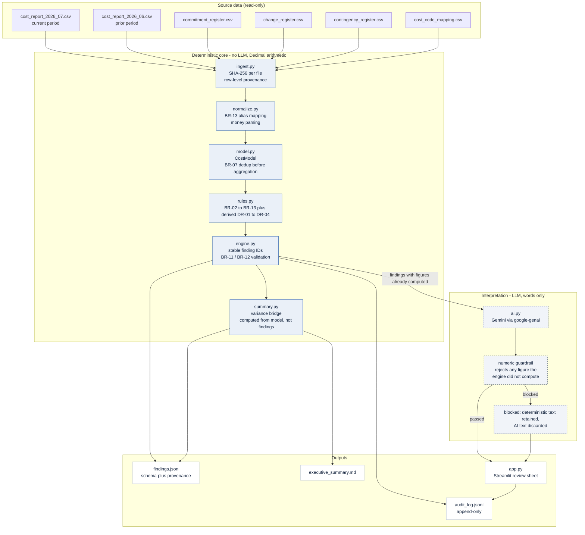
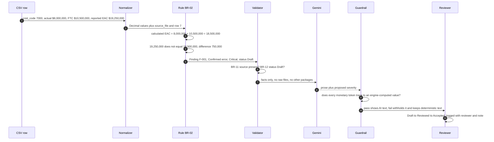

# Architecture and data flow

## Component architecture

The dashed boundary is the important one: **every figure crosses it fully formed.**
Delete the AI subgraph entirely and `findings.json` still contains the same
numbers, the same severities and the same source references.

## Data flow for one finding

## Why each component exists

| Component | Why it is required | Why not something larger |
| --- | --- | --- |
| `Decimal` arithmetic | Financial equality must be exact for BR-02 and BR-03, and for tests to assert values rather than tolerances | Floats make `18500000.000000002` possible, which is indefensible in a cost report |
| Row-level provenance in `ingest` | BR-11 becomes structural: a finding cannot exist without a source | Asking the LLM to cite sources produces citations that look right and cannot be checked |
| `normalize` with an explicit mapping table | BR-13. `GEN-5000` must join to `5000` or the $67,000,000 turbine contract silently drops out of reconciliation | Fuzzy matching or embedding similarity would guess, and a wrong guess is invisible |
| Dedup inside `model`, before aggregation | BR-07. Exposure is $7,550,000 deduplicated and $8,200,000 raw | — |
| `rules` as plain functions | Each rule is independently testable and readable next to the business-rule table | A rules DSL adds indirection with no new capability at this size |
| `engine` validation step | BR-11 and BR-12 are enforced in code, so a new rule cannot ship a finding without a source or one that starts life Accepted | — |
| `summary` computed from the model | Prevents a finding being double counted into the headline number | Summing findings would count the $750,000 EAC error twice, once at package level and once at project level |
| `ai` layer | Classification, explanation and recommendation are genuine language tasks. Judging whether "No material change this period" is consistent with an $8,000,000 movement is not arithmetic | — |
| Numeric guardrail | Makes BR-01 enforceable rather than aspirational | Prompt instructions alone are unverifiable |
| `audit_log.jsonl` | Append-only history of runs and status changes with input hashes | A mutable table loses the question of what was known when |

## Components deliberately not built

**No vector database and no RAG.** The dataset is twelve packages across five
tables with a known, fixed schema. Retrieval is a dictionary lookup on cost code.
Traceability requires an exact row reference such as `change_register.csv row 6`,
and embedding similarity degrades exactly that property. A vector store would add
an index to keep in sync, a chunking strategy to tune and a new class of silent
retrieval failure, in exchange for nothing.

**No multi-agent system.** There is no task decomposition here that one
constrained call per finding does not handle. Multiple agents negotiating over
financial findings would introduce nondeterminism into a tool whose entire value
proposition is that the same inputs always produce the same numbers.

**No LLM function calling over the data.** Letting the model query the tables
would let it compute, which BR-01 forbids. The model receives a finished finding.

**No ORM or database in the prototype.** Findings are recomputed from source on
every run, which is the correct default for a reconciliation tool: state that can
drift from its source is a liability. Persistence is a next step, and the shape it
should take is described in the README.

## Extending the ruleset

A new rule is a function with the signature `(CostModel, Thresholds) -> list[Finding]`,
registered in `ALL_RULES`. Because `engine.validate()` runs after every rule, a new
rule physically cannot emit a finding without a source reference or with a status
other than Draft. The convention is that each new rule arrives with a test that
asserts its exact expected figures against the fixture data.
